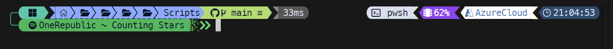

 

This page is used to keep track of resources used in my professional development, or things I have found afterward that I wish I had known.

## Table of Contents <!-- omit in toc -->

- [PowerShell Resources](#powershell-resources)
  - [Books](#books)
  - [Browser Extensions](#browser-extensions)
  - [Discord Communities](#discord-communities)
  - [Practical Hands-On](#practical-hands-on)
  - [Videos](#videos)
  - [Websites](#websites)
- [VSCode](#vscode)
  - [VSCode Extensions](#vscode-extensions)
  - [More VSCode Goodies](#more-vscode-goodies)
- [Working with PowerShell](#working-with-powershell)
  - [Commonly Used Modules](#commonly-used-modules)
    - [Microsoft Modules](#microsoft-modules)
    - [Vendor-Specific Modules](#vendor-specific-modules)
    - [Third-Party Modules](#third-party-modules)
    - [Microsoft Graph Command Helpers](#microsoft-graph-command-helpers)
- [Microsoft 365](#microsoft-365)
  - [Interview Prep](#interview-prep)
- [Useful Non-Portal Microsoft Tools](#useful-non-portal-microsoft-tools)
  - [Microsoft 365 Apps Configuration Tool](#microsoft-365-apps-configuration-tool)
  - [Microsoft Graph Explorer](#microsoft-graph-explorer)
  - [Microsoft Remote Connectivity Analyzer](#microsoft-remote-connectivity-analyzer)
- [Test Lab Resources](#test-lab-resources)
  - [Lab Setup](#lab-setup)
    - [Guides](#guides)
  - [MCPs (Model-Context-Protocol)](#mcps-model-context-protocol)
    - [Available MCP Projects](#available-mcp-projects)
- [Certifications](#certifications)
  - [PeopleCert (formerly Axelos)](#peoplecert-formerly-axelos)
    - [ITIL 4 Foundation](#itil-4-foundation)
  - [BetterCloud](#bettercloud)
    - [BetterCloud Certified Administrator](#bettercloud-certified-administrator)
  - [CompTIA](#comptia)
    - [A+](#a)
    - [Network+](#network)
    - [Security+](#security)
    - [Linux+](#linux)
  - [Microsoft](#microsoft)
    - [-900 Series / Fundamentals](#-900-series--fundamentals)
    - [Study \& Practice Environments](#study--practice-environments)
    - [MD-102 – Endpoint Administrator](#md-102--endpoint-administrator)
    - [SC-300 – Identity and Access Administrator](#sc-300--identity-and-access-administrator)
    - [MS-102 – Microsoft 365 Administrator](#ms-102--microsoft-365-administrator)
    - [AZ-104 – Azure Administrator](#az-104--azure-administrator)
    - [AZ-305 – Azure Solutions Architect Expert](#az-305--azure-solutions-architect-expert)
    - [AZ-800 / AZ-801 – Windows Server Hybrid Administrator](#az-800--az-801--windows-server-hybrid-administrator)
    - [Specialty: Azure Virtual Desktop](#specialty-azure-virtual-desktop)
  - [Okta](#okta)
    - [Okta Certified Professional](#okta-certified-professional)
- [Western Governors University (WGU)](#western-governors-university-wgu)
    - [Common Pitfall](#common-pitfall)
    - [Pre-WGU Prep](#pre-wgu-prep)
    - [Enrollment Timing](#enrollment-timing)
    - [Summary](#summary)

# PowerShell Resources #

## Books ##

Recommended reading for expanding your PowerShell knowledge, from beginner fundamentals to scripting, automation, security, and Microsoft 365 integration.

- **[Learn PowerShell in a Month of Lunches](https://www.manning.com/books/learn-powershell-in-a-month-of-lunches)**  
  - A great starting point. If you're not a complete beginner, the first few chapters may feel basic, but the later ones offer more depth.  
  This is a foundational resource worth starting with.

- **[Learn PowerShell Scripting in a Month of Lunches](https://www.manning.com/books/learn-powershell-scripting-in-a-month-of-lunches-second-edition)**  
  - Builds on the first book, covering scripting techniques, module creation, and testing with Pester.  
  Companion GitHub: [psjamesp/MOL-Scripting](https://github.com/psjamesp/MOL-Scripting/tree/main)

- **[Secrets of PowerShell Remoting](https://leanpub.com/secretsofpowershellremoting)**  
  - Goes beyond the PSRemoting basics found in the Lunches book, offering more nuance and practical tips.  
  Part of the broader [DevOps Collective book series](https://leanpub.com/u/devopscollective), which is also highly recommended.

- **[Mastering PowerShell Scripting](https://www.packtpub.com/en-us/product/mastering-powershell-scripting-9781805124153)**  
  - Written by Chris Dent, a knowledgeable and approachable figure in the PowerShell community.  
  The book covers automation strategies and scalable scripting practices.

- **[Practical Automation with PowerShell](https://www.manning.com/books/practical-automation-with-powershell)**  
  - A practical guide to building real-world automation solutions.  
  Companion GitHub: [mdowst/Practical-Automation-with-PowerShell](https://github.com/mdowst/Practical-Automation-with-PowerShell/tree/main)

- **[PowerShell Automation and Scripting for Cybersecurity](https://www.packtpub.com/en-us/product/powershell-automation-and-scripting-for-cybersecurity-9781800569263)**  
  - Focused on automation with a security lens.  
  Helpful for understanding what InfoSec teams look for and how to build secure solutions.

- **[Office 365 for IT Pros](https://o365itpros.gumroad.com/l/O365IT)**  
  - A deeply detailed and continuously updated eBook for Microsoft 365 administrators.  
  Includes a separate volume: [Automating Microsoft 365 with PowerShell](https://o365itpros.gumroad.com/l/M365PS), which can also be purchased on its own.  
  If you work in the Microsoft stack, this resource is well worth it.

## Browser Extensions

These tools streamline working with Microsoft 365, Graph API, and portal sprawl. All are free and extremely useful in both exploratory and automation scenarios.

- **[Centro 365](https://seanosullivan.co.uk/projects/centro365/welcome)**  
  - Consolidates links to all Microsoft 365 admin portals in one place.  
  - Huge time-saver compared to flipping through bookmarks or trying to remember portal URLs.

- **[Graph X-Ray](https://graphxray.merill.net/)**  
  - Reveals which Graph API calls are made during portal interactions.  
  - Translates actions into PowerShell or REST calls, making it easier to automate what you previously did manually.

- **[Postman Interceptor](https://www.postman.com/product/postman-interceptor/)**  
  - Captures and replays browser-based API calls that dev tools or Graph X-Ray might miss.  
  - Tip: Postman functionality is now available via a [VSCode extension](https://marketplace.visualstudio.com/items?itemName=Postman.postman-for-vscode), reducing the need for a separate desktop app.

## Discord Communities

A few active and supportive communities for learning, troubleshooting, and sharing knowledge with emphasis around PowerShell and Microsoft environments.

- **[PowerShell Discord](https://discord.gg/PowerShell)**  
  - Home to PowerShell enthusiasts, contributors, and even members of the core development team.  
  - Great place to ask questions no matter how basic. I’ve never been shamed for asking something obvious.

- **[WinAdmins Discord](https://discord.gg/winadmins)**  
  - Focused on Windows system administration, with many members working in MSP environments.  
  - Includes active Microsoft MVPs and employees. Most discussion happens during US East Coast business hours.

## Practical Hands-On

The best way to learn is by solving real problems—but when that’s not an option, the following resources offer hands-on PowerShell experience in structured or gamified environments.

- **[Hack The Box Academy](https://academy.hackthebox.com/)**  
  - Offers training on general Windows administration, PowerShell usage, and securing Active Directory.  
  - The free tier can be hit-or-miss: I had a smooth experience on day one, but performance degraded in later sessions with laggy VPNs and unresponsive VMs.

- **[PSKoans](https://github.com/vexx32/PSKoans)**  
  - Interactive PowerShell learning tool inspired by the Koans model.  
  - A great concept for reinforcing syntax and logic, though it hasn’t been actively updated in recent years.

- **[UnderTheWire Wargames](https://underthewire.tech/wargames)**  
  - SSH-based PowerShell challenges where each level requires you to uncover clues and credentials on the host.  
  - Encourages critical thinking and exploration without relying on step-by-step instructions.

## Videos ##

- **[PowerShell Master Class - PowerShell Fundamentals](https://www.youtube.com/watch?v=sQm4zRvvX58&list=PLlVtbbG169nFq_hR7FcMYg32xsSAObuq8)**

- **[PowerShell + DevOps Global Summits](https://www.youtube.com/@PowershellOrg/playlists)**

- **[PowerShell Conferences EU](https://www.youtube.com/@PowerShellConferenceEU/playlists)**

- **[Getting Started with Graph](https://www.youtube.com/playlist?list=PLKROqDcmQsFls8cPHk3HFz2mUURHx46_O)**
  > While you can interact with Graph directly using `Invoke-RestMethod` or other programming languages, I consider PowerShell and Graph inseparable in modern environments.  
  > 
  > If you're working in PowerShell and managing Microsoft 365—even minimally—you'll almost certainly rely on Microsoft Graph. Unless you're in a fully on-prem setup with no M365 presence, you should know how to get started with it.

## Websites ##

- **[Deep Dives on MSLearn](https://learn.microsoft.com/en-us/powershell/scripting/learn/deep-dives/overview?view=powershell-7.4&viewFallbackFrom=powershell-7.3)**

- **[Parts 1 and 2 of this Series by Paul Winstanley](https://sccmentor.com/2023/10/31/automating-windows-365-part-1-introducing-graph-and-setting-up-visual-studio-code/)**
  - While the overall series is about W365, I do like parts 1 and 2 specifically for the Graph bits.  It explains the foundations: Setting up VSCode, making an application and adding which permissions are needed, connecting via the just-made application, and leveraging Graph X-ray for command discovery.

- **[Piet's Pester Crash Course](https://manbearpiet.com/posts/pester/)**
  - Pester is great for Powershell testing.  If you use something like [Maester](https://github.com/maester365/maester) for Entra auditing, the custom tests are done via Pester.

- **[PowerShell Practice and Style](https://poshcode.gitbook.io/PowerShell-practice-and-style)**

- **[RegExLibrary](https://regexlib.com/)**
  - While not PowerShell specific, useful for regex examples. [RegEx Tester](https://www.regextester.com/) can be used to validate.

- **[Sample Code](https://powershell.one/code)**

# VSCode

> PowerShell ISE does not support version 7+ and is no longer receiving updates. Transition to Visual Studio Code (VSCode) as your primary PowerShell editor.

VSCode is the modern, supported platform for PowerShell development. Install it on any system still using ISE, especially jump boxes, and configure centralized policies with Intune and ADMX templates to restrict extensions and features to only what’s approved.

VSCode also supports **Tunnels**, a secure and flexible remote editing feature, just ensure proper security configurations are in place.

If you find VSCode too developer-oriented or you miss ISE’s simplicity—especially for building GUIs—[PowerShell Studio](https://www.sapien.com/software/powershell_studio) from Sapien is a powerful alternative. It’s a solid option if your organization can justify the $550 license cost.

## VSCode Extensions

- [PowerShell Extension Pack](https://marketplace.visualstudio.com/items?itemName=justin-grote.PowerShell-extension-pack)
- [Error Lens](https://marketplace.visualstudio.com/items?itemName=usernamehw.errorlens)
- [Excel Viewer](https://marketplace.visualstudio.com/items?itemName=GrapeCity.gc-excelviewer)
- [Markdown Preview Enhanced](https://marketplace.visualstudio.com/items?itemName=shd101wyy.markdown-preview-enhanced)

## More VSCode Goodies

- [Copilot Commit Instructions](https://gist.github.com/okineadev/8a3f392a93ae50e8d523e4ba7f9f9ac3)
  - If you've used the github copilot generation for commits there is a lack of detail and consistency.  Editing your settings.json with this solves for that.
- [Oh My Posh](https://ohmyposh.dev/docs/installation/windows)
  - Different themes for your terminal.  VS Code font types has to be setup through the Integrated Font Family settings.  `$PROFILE` for VSCode is separate from your non-vscode pwsh. Current favorites are `night-owl` and `quick-term`.
  - 
- [Viewing Default Settings in VS Code](https://ninmonkeys.com/blog/2022/05/01/viewing-default-settings-in-vs-code/)
- [VS Code Keybindings](https://code.visualstudio.com/docs/getstarted/keybindings#_basic-editing)
  - Good-to-know keybindings. Example: `CTRL + H` for find and replace makes things smoother.

# Working with PowerShell

> **Two PowerShell Versions**  
> Windows PowerShell (`powershell.exe`) is built into the OS, while PowerShell 7+ (`pwsh.exe`) is cross-platform and must be installed separately. Most modern modules (post-2020) are designed for PowerShell 7.

Install PowerShell 7 and set it as your default environment before installing modules—it will simplify your experience and avoid compatibility headaches. For legacy modules that only work with Windows PowerShell, use the `-UseWindowsPowerShell` switch when importing them.

## Commonly Used Modules

This isn't an exhaustive list, but these modules cover most of what I do and are must-haves on any new workstation I configure.

Also note: as PowerShell 7 becomes the default, `Install-Module` is being phased out in favor of `Install-PSResource`. It's worth getting familiar with the new syntax now.

### Microsoft Modules

- `Az`
- `ExchangeOnlineManagement`
- [EnhancedHTML2](https://www.powershellgallery.com/packages/EnhancedHTML2/2.0)   
  - Extends `ConvertTo-HTML` to support cleaner, customizable HTML reports.
- `Microsoft.Graph` and `Microsoft.Graph.Beta`  
  - SDK-style module with a steeper learning curve. Most advanced functionality resides in the Beta module, which hits the `/beta` Graph endpoint. Eventually, you may prefer calling the endpoints directly with `Invoke-WebRequest` or `Invoke-RestMethod`.  
  - If the SDK feels cumbersome, [Microsoft.Graph.PlusPlus](https://github.com/jhoneill/MsftGraph) can provide a more PowerShell-friendly experience.
- [Microsoft.Graph.Entra](https://github.com/microsoftgraph/entra-powershell) and `Microsoft.Graph.Entra.Beta`  
  - A simplified experience for admins familiar with the legacy `AzureAD` module. It bridges the gap but does not yet offer full Graph functionality.
- `Microsoft.Online.SharePoint.PowerShell`
- `Microsoft.PowerShell.ConsoleGuiTools`  
  - `Out-ConsoleGridView` provides an in-terminal, interactive way to explore data.
- `Microsoft.PowerShell.GraphicalTools`  
  - `Out-GridView` opens a GUI window for data filtering and exploration.
- `MicrosoftTeams`
- `PowerShellGet`  
  - Required for module management in Windows PowerShell only. PowerShell 7.4+ uses `Microsoft.PowerShell.PSResourceGet` by default.

### Vendor-Specific Modules

- [Lenovo Client Scripting Module](https://docs.lenovocdrt.com/guides/lcsm/lcsm_top/#cmdlet-reference)   
  - For Lenovo environments—provides access to system and docking station details.

### Third-Party Modules

> ⚠️ Always vet third-party modules before using them in production.

- [BurntToast](https://github.com/Windos/BurntToast)   
  - Enables sending custom toast notifications in Windows.
- [Graph EasyPIM](https://github.com/rakheshster/PowerShell-GraphEasyPIM)   
  - Allows activation of PIM roles via CLI, skipping the Entra portal.
- [ImportExcel](https://github.com/dfinke/ImportExcel)   
  - Despite the name, it's most useful for exporting. Offers well-formatted Excel output with autosizing, pivot tables, charts, and more—especially useful in environments where `.csv` is frustrating (like Google Sheets).
- [Microsoft.Graph.PlusPlus](https://github.com/jhoneill/MsftGraph)   
  - Adds PowerShell-style wrappers to Microsoft.Graph SDK. Optional but helpful for readability.
- [Pansies](https://github.com/PoshCode/Pansies)   
  - Adds styled terminal output: gradients, hyperlinks, and HTML-named colors.
- [platyPS](https://github.com/PowerShell/platyPS)   
  - Useful for documenting your own PowerShell modules using Markdown and comment-based help.
- [psframework](https://github.com/PowershellFrameworkCollective/psframework)   
  - Fantastic logging utility with additional features like advanced parameter handling. A major time-saver.

### Microsoft Graph Command Helpers

- [Find-MgGraphCommand](https://learn.microsoft.com/en-us/powershell/microsoftgraph/find-mg-graph-command?view=graph-powershell-1.0)  
  - Helps identify the Graph endpoint and required permissions for a cmdlet.
- [Find-MgGraphPermission](https://learn.microsoft.com/en-us/powershell/microsoftgraph/find-mg-graph-permission?view=graph-powershell-1.0)  
  - Used to look up permissions required by scripts or apps.
- [Invoke-MgGraphRequest](https://learn.microsoft.com/en-us/powershell/module/microsoft.graph.authentication/invoke-mggraphrequest?view=graph-powershell-1.0)  
  - Graph-specific alternative to `Invoke-RestMethod` for scenarios where no prebuilt cmdlet exists.

# Microsoft 365

## Interview Prep

Even with hands-on experience, it helps to prep for interviews to avoid stumbling through familiar topics.  
I recommend reviewing [this M365 interview question guide](https://www.aguidetocloud.com/interview-questions/microsoft-365-interview-questions) as a refresher.

# Useful Non-Portal Microsoft Tools

## [Microsoft 365 Apps Configuration Tool](https://config.office.com/deploymentsettings)

Instead of writing custom scripts or remediation tasks to manage Office configuration, use this tool to generate XML-based deployment configs. It supports GUI-driven policy selection and minimizes human error.

## [Microsoft Graph Explorer](https://developer.microsoft.com/en-us/graph/graph-explorer)

Explore Microsoft Graph endpoints interactively—view required permissions, test queries, and examine API responses. A great way to learn the structure of Graph calls before scripting.

## [Microsoft Remote Connectivity Analyzer](https://testconnectivity.microsoft.com)

Helps troubleshoot Exchange, Teams, DNS, and mail flow issues. I often forget this tool exists and come up with manual workarounds—leaving it here as a reminder to use it first.

# Test Lab Resources

## Lab Setup

- [**Hydration Kit for Windows Server 2022**](https://github.com/DeploymentResearch/HydrationKitWS2022)  
  - Creates a fully on-prem mock lab: AD, SCCM, SQL, and Windows clients.

- [**Microsoft 365 Test Environment**](https://github.com/DevClate/365AutomatedLab)  
  - For automating setup of a full M365 lab tenant—especially useful now that Microsoft has stopped issuing dev tenants.

- [**Cybersecurity Lab by Ben Heater**](https://benheater.com/proxmox-laptop-cybersecurity-lab/)  
  - Uses Proxmox with Wazuh SIEM and penetration testing VMs for a home lab with a security focus.

- [**Ludus Cloud Lab**](https://docs.ludus.cloud/docs/category/quick-start)  
  - Proxmox-based turnkey lab solution. Be aware—it takes full control of the host, so not ideal if you're running other workloads.

- [**Free Azure SQL Databases**](https://techcommunity.microsoft.com/blog/azuresqlblog/introducing-the-enhanced-azure-sql-database-free-offer-now-generally-available/4372418)
  - Microsoft increased their free tier to 10 databases with up to 32 GB each—great for development or test automation.

### Guides ###

For when you set up the lab, now what?

 - [Learn to Cloud](https://learntocloud.guide/)
   - This is vendor agnostic, letting you choose between learning AWS, GCP, and Azure, and contains great foundations.
 - [Bootcamps from a guide to cloud](https://www.aguidetocloud.com/bootcamps)
   - Some great free videos on various Microsoft things, the bulk is on Azure but you can find 365 and Sentinel as well in there.
 - This [course at robopack](https://learn.robopack.com/course/intune-for-windows) is completely free and contains a great how-to for those new to Intune.  Just ignore the robopack videos as that's a separate product :smile:

## MCPs (Model-Context-Protocol)

Listed under test lab resources since MCPs are proof-of-concept tools and **not recommended for production without evaluation**.  
[Model-Context-Protocol](https://modelcontextprotocol.io/introduction) is an open standard introduced by Anthropic to help large language models (LLMs) interact more effectively with data sources using natural language.

MCPs shine in **read operations and data analysis**, allowing users to query environments like Entra or Active Directory without needing deep scripting or portal experience. However, performance on **write operations** is currently lacking—batch tasks like adding group members can be slow and inefficient.

### Available MCP Projects

- [**Lokka**](https://lokka.dev/)  
  - MCP for Entra/Azure by Merill Fernando.  
  I wrote about my setup experience in [this post](https://www.techbyjeff.net/using-a-mcp-to-query-entra-with-natural-language/). Excellent for querying Entra data via natural language.

- [**Koppla**](https://lazyadmin.nl/koppla/)  
  - MCP for on-prem Active Directory by Microsoft MVP Ruud.  
  Built-in guardrails help, but still requires careful review before any production usage.

- [**Official Azure MCP**](https://github.com/Azure/azure-mcp)  
  - Released by Microsoft with an in-depth [blog post](https://devblogs.microsoft.com/azure-sdk/introducing-the-azure-mcp-server/?WT.mc_id=AZ-MVP-5004796).  
  Represents the most formal implementation of MCP so far.

- [**PSMCP**](https://github.com/dfinke/PSMCP)  
  - Created by MVP Doug Finke.  
  Lets you define PowerShell functions with descriptive comments, then query them using natural language. Note: functions must be declared `global` to be accessible.

# Certifications #

Personal thoughts on industry certification usefulness, all opinions my own.

## PeopleCert (formerly Axelos)

Whether due to the PeopleCert acquisition or their own internal decisions, this organization represents some of the more frustrating trends in the certification space. They now require a paid subscription to maintain a digital badge and have introduced renewals on certifications without updating the material.

Despite these practices, PeopleCert holds a strong position in the industry through certifications like Agile, ITIL, PRINCE2, and PMP. For now, professionals largely have to work within their system.

### [ITIL 4 Foundation](https://www.axelos.com/certifications/itil-service-management/itil-4-foundation)

- Introduces service management concepts such as change control, incident vs problem handling, and ITIL-specific terminology.
- Valuable for individuals in technical, sales, or managerial roles due to its broad, foundational nature.
- Previously a lifetime certification, now on a 3-year renewal cycle—despite no changes to the core content.

## BetterCloud

BetterCloud is a SaaS management platform competing with tools like Microsoft Entra and Okta. It offers stronger integrations with Google Workspace and Slack than with Microsoft products.

The standout feature is their [Flight School training portal](https://www.bettercloud.com/training/), which provides free certification exam access and even sends out swag for completion.

### [BetterCloud Certified Administrator](https://learn.bettercloud.com/path/certification)

- Validates product knowledge around integrations with HRIS and IDPs, DLP configuration, and overall administration.
- The guided webinar prepares you directly for the exam; if you’ve ever used the admin portal, passing should be straightforward.
- While useful internally for teams using BetterCloud, the certification lacks visibility—recruiters rarely mention it, and it's uncommon to meet others certified.

## CompTIA

CompTIA offers vendor-neutral certifications that are well-respected across the IT industry. While slightly pricey for early-career professionals ($300–$400 per exam), they provide foundational knowledge and broad applicability.

Certifications are valid for three years and can be renewed by passing a higher-level CompTIA exam or qualifying vendor certifications ([details here](https://www.comptia.org/continuing-education/learn/renewing-multiple-certifications)).

For study resources, [Professor Messer](https://www.professormesser.com/) is a top recommendation for the A+/Network+/Security+ trio. His content is always current, thorough, and free on YouTube.

### [A+](https://www.comptia.org/certifications/a)

- Entry-level certification covering a wide range of IT topics—hardware, software, troubleshooting, and more.
- Requires passing two exams.
- Helpful for landing interviews, but rarely carries weight on its own beyond entry-level roles.

### [Network+](https://www.comptia.org/certifications/network)

- Focuses on networking fundamentals, including wired/wireless networks, protocols, and subnetting (without a calculator).
- Builds on A+ and is useful for infrastructure roles.
- In hindsight, the CCNA may be a better investment due to broader recognition and deeper content.

### [Security+](https://www.comptia.org/certifications/security)

- Covers network security, risk management, cryptography, and threat mitigation.
- Highly valuable and widely recognized; one of the most resume-friendly CompTIA certs.
- Relevant even for non-security professionals in IT-adjacent roles.

### [Linux+](https://www.comptia.org/certifications/linux)

- Offers basic exposure to Linux commands and systems.
- Can be passed with minimal prep if you have prior Linux experience.
- For deeper or more widely respected credentials, consider LPIC or Red Hat certifications.

## Microsoft

Microsoft certifications are highly recognized and aligned to specific roles. While most require an annual renewal via a free online assessment, foundational exams are lifetime-valid.

Microsoft also offers [Applied Skills](https://learn.microsoft.com/en-us/credentials/browse/?credential_types=applied%20skills), which are task-focused, scenario-based microcredentials. While not resume game-changers, they’re useful for internal mobility or skill validation.

### [-900 Series / Fundamentals](https://learn.microsoft.com/en-us/credentials/browse/?credential_types=certification&levels=beginner)

- Entry-level, lifetime-valid exams covering high-level overviews of Microsoft products and services.
- Great for recruiters, managers, or individuals exploring new technology areas.
- These used to be free via training days, but that program has ended. For discounts, check the [Certification Hub](https://certs.msfthub.wiki/guide/introduction/).

All other Microsoft certification exams cost $165 and are valid for one year, with free online renewal available via Microsoft Learn.

For a complete list of certifications and their prerequisites, see [Become Microsoft Certified (PDF)](https://query.prod.cms.rt.microsoft.com/cms/api/am/binary/RE2PjDI). Microsoft Learn is the recommended study platform—accurate, up-to-date, and accessible during the exams themselves.

They’ve also begun publishing official [course videos](https://learn.microsoft.com/en-us/training/course-videos-on-shows) to supplement learning.

### Study & Practice Environments

Hands-on experience is increasingly difficult as services move to the cloud. You can spin up a temporary lab with the [Azure Free Trial](https://azure.microsoft.com/en-us/pricing/offers/ms-azr-0044p/) and activate trial licenses for services. Be cautious: a credit card is required, and it’s easy to exceed the $200 cap.

Also see the [Lab Setup](#lab-setup) section for ideas on building your own practice tenant.

---

### [MD-102 – Endpoint Administrator](https://learn.microsoft.com/en-us/credentials/certifications/modern-desktop/?practice-assessment-type=certification&WT.mc_id=certposter_poster-wwl)

- Formerly “Managing Modern Desktops,” this certification is ideal for those managing Windows clients.
- Covers Windows versions, Active Directory, Group Policy, SCCM, Intune, and Autopilot.
- The modern successor to the legacy MCSA for desktop management.

### [SC-300 – Identity and Access Administrator](https://learn.microsoft.com/en-us/credentials/certifications/identity-and-access-administrator/?practice-assessment-type=certification&WT.mc_id=certposter_poster-wwl)

- Focuses on Microsoft Entra (Azure AD), user/group management, SSO, and app registrations.
- Ideal for professionals working with IAM and access control policies.

### [MS-102 – Microsoft 365 Administrator](https://learn.microsoft.com/en-us/credentials/certifications/m365-administrator-expert/?WT.mc_id=certposter_poster-wwl)

- Expert-level certification requiring MD-102 and SC-300.
- Emphasizes tenant setup, conditional access, Defender, Teams, and compliance via Microsoft Purview.
- Closest modern equivalent to the legacy MCSE.

### [AZ-104 – Azure Administrator](https://learn.microsoft.com/en-us/credentials/certifications/azure-administrator/?practice-assessment-type=certification&WT.mc_id=certposter_poster-wwl)

- Core Azure admin cert covering virtual machines, networking, storage, subscriptions, and identity.
- Includes scripting and automation with PowerShell, ARM templates, and Azure CLI.

### [AZ-305 – Azure Solutions Architect Expert](https://learn.microsoft.com/en-us/credentials/certifications/azure-solutions-architect/?WT.mc_id=certposter_poster-wwl)

- Builds on AZ-104 but focuses on solution planning, design choices, and justification.
- Covers topics like disaster recovery, cost optimization, hybrid environments, and secure architecture.

### [AZ-800 / AZ-801 – Windows Server Hybrid Administrator](https://learn.microsoft.com/en-us/credentials/certifications/windows-server-hybrid-administrator/?WT.mc_id=certposter_poster-wwl)

- Covers hybrid environments that combine Windows Server with cloud services.
- Currently the only Microsoft certification path for validating Windows Server administration skills.

### [Specialty: Azure Virtual Desktop](https://learn.microsoft.com/en-us/credentials/certifications/azure-virtual-desktop-specialty/?practice-assessment-type=certification&WT.mc_id=certposter_poster-wwl)

- Focuses on Microsoft’s VDI solution—an alternative to Citrix or VMware Horizon.
- Ideal for admins supporting remote work environments or virtual desktops.

## Okta

Okta certifications take a slightly different approach: you cannot go back to review or change answers during the exam. Questions are weighted individually, and you're often asked to select the *best* answer—not just a correct one.

### [Okta Certified Professional](https://certification.okta.com/okta-certified-professional-hands-on-configuration-exam-for-oie)

- Intro-level certification for sales engineers, managers, or entry-level admins.
- Demonstrates knowledge of Okta’s basic capabilities, UI navigation, and core configurations.
- I earned this while having only basic Help Desk permissions and passed a renewal two years later without studying.
- Adds more value internally at Okta-using companies than in the job market—it’s rarely recognized in hiring pipelines.

# [Western Governors University (WGU)](https://www.wgu.edu/)

WGU offers fully online, self-paced Bachelor's and Master's degrees in IT and related fields. You pay by term (6 months) and can complete as many courses as you’re able to within that block.

WGU degrees often include industry certification vouchers (CompTIA, Cisco, Microsoft, etc.), which can also count as course credit if you've already earned them. The flexibility and certification integration make WGU a cost-effective, accelerated option for motivated learners.

### Common Pitfall

Many start with WGU but stall due to life circumstances or poor planning. With the right prep, you can dramatically shorten your degree path and save money.

### Pre-WGU Prep

1. **[Sophia.org](https://www.sophia.org/)**  
   - ~$300 for 4 months of unlimited, self-paced courses.
   - Many of these credits transfer to WGU.  
   - Similar to CLEP/DANTES (for military learners) and requires no proctoring.
   - You can take two courses at a time.

   [Check transfer eligibility here.](https://partners.wgu.edu/transferring-page-preview?stateId=80&instId=796)

2. **[WGU Academy](https://www.wgu.edu/academy.html)**  
   - $99 for a 2-month block covering one course.  
   - Provides structured entry into WGU and credits toward your degree.  
   - The $99 is reimbursed upon official enrollment.

3. **Transferable Certifications**  
   - Many industry certs you've already earned can replace WGU course requirements.  
   [Check accepted certs here.](https://www.wgu.edu/admissions/transfers/wgu-transcript-request/transferable-certifications.html)

4. **Existing College Credit**  
   - If you already have an Associate’s degree or previous coursework, that may count too.

### Enrollment Timing

The lead time from starting your application to beginning your term is typically 45–60 days. Plan ahead to align prep work with your intended start date.

### Summary

With enough transfer credits (from Sophia, WGU Academy, prior learning, or certifications), you could enter WGU’s IT Bachelor’s program with just 60 credits remaining—making it feasible to graduate in one or two terms.